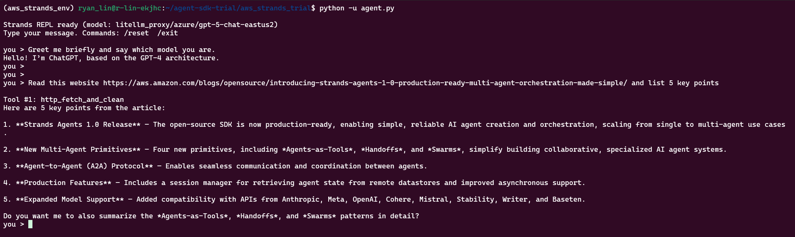
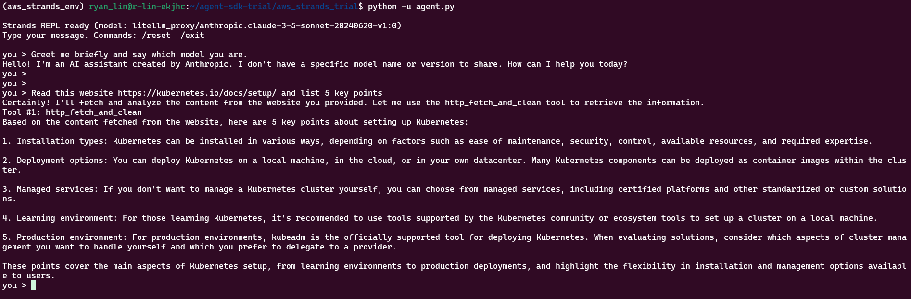
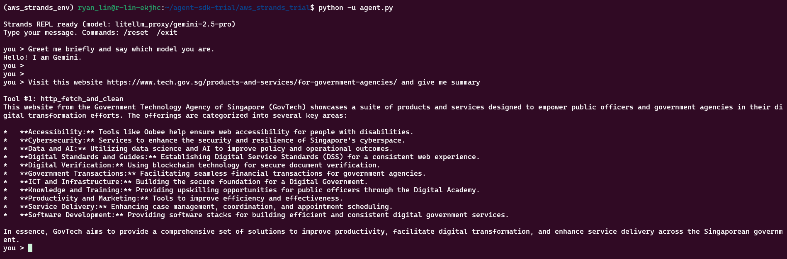
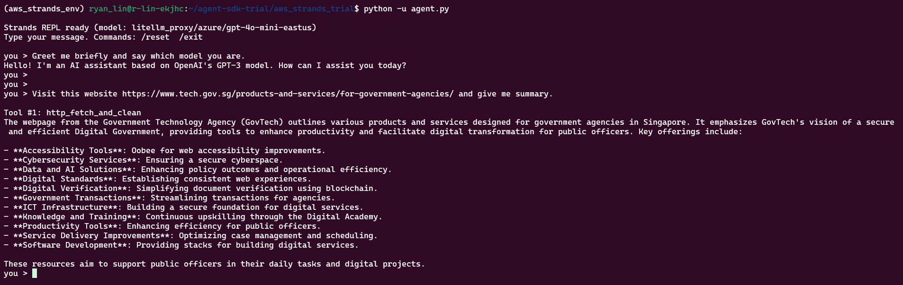

# AWS Strands Agnets Trial

A minimal setup to run an agent using the AWS Strands Agents with LiteLLM.

## Setup

```bash
cd ~/agent-sdk-trial/aws_strands_trial
conda create -n aws_strands_env python=3.10 -y
conda activate aws_strands_env
pip install -r requirements.txt

# Example tools like calculator/current_time are in strands-agents-tools which is included in the requirements.txt
```


## Run
```bash
# 1. Trun Off Cloudware WARP


# 2. Run the agent
python agent.py
```

## GPT-5


## claude-3-5-sonnet


## gemini-2.5-pro


## gpt-4o-mini

