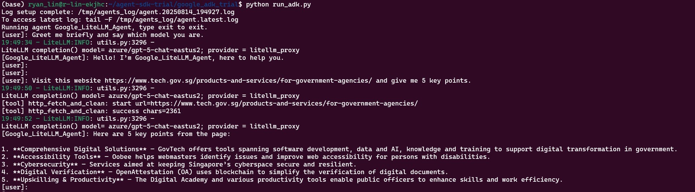
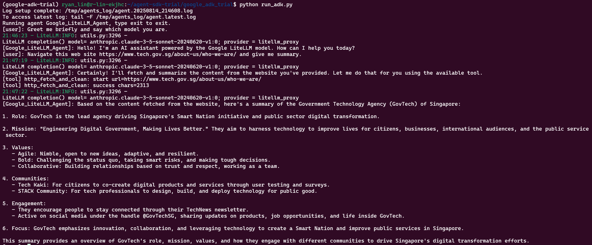
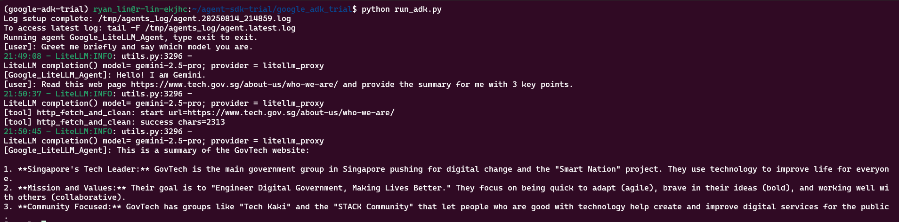
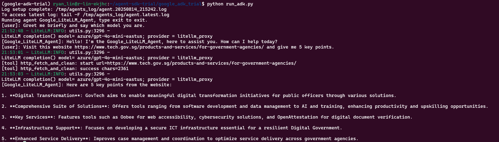

# Google ADK Trial (LiteLLM + Web Fetch Tool)
Minimal agent wired to a LiteLLM proxy with a Web Fetch & Summarize tool. Includes a wrapper that hides ADK’s noisy `UserWarning` lines.

## Fresh Setup

```bash
cd ~/agent-sdk-trial/google_adk_trial
conda create -n google-adk-trial python=3.12 -y
conda activate google-adk-trial

# Install dependencies
python -m pip install -U -r requirements.txt
```

## Run

```bash
# 1. Trun Off Cloudware WARP

# 2. Run the agent
cd ~/agent-sdk-trial/google_adk_trial
python run_adk.py
```

## GPT-5


## SONNET


## GEMINI


## GPT4O-MINI

