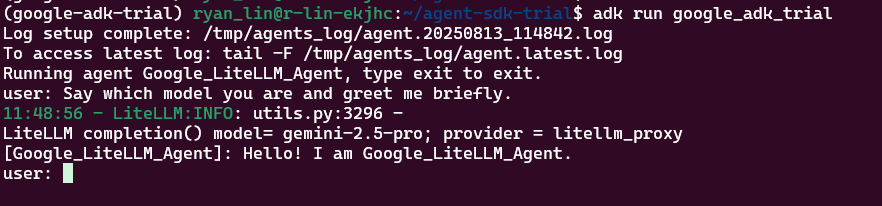

# OpenAI Agent SDK Trial

A minimal setup to run an agent using the OpenAI Agent SDK.

## Setup

```bash
cd ~/agent-sdk-trial/openai-agent-sdk-trial
conda create --name google-adk-trial python=3.12 -y
conda activate google-adk-trial
pip install google-adk python-dotenv boto3
pip install -U "litellm>=1.72.1"
pip install -U "litellm[proxy]>=1.72"
```

## Run

```bash
# 1. Trun Off Cloudware WARP

# 2. Run the agent
cd ~/agent-sdk-trial/
adk run my_agent.gemini_agent
```

## CHT-5


## SONNET


## GEMINI


## GPT4O-MINI
