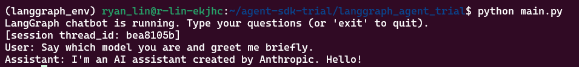

# LangGraph Agnet Trial

A minimal setup to run an agent using the LangChain/LanggRaph with LiteLLM.

## Setup

```bash
cd ~/agent-sdk-trial/langgraph_agent_trial
conda create -n langgraph_env python=3.10 -y
conda activate langgraph_env
pip install langgraph langchain-litellm python-dotenv langchain
```

## Run
```bash
# 1. Trun Off Cloudware WARP


# 3. Run the agent
python main.py
```

## CHT-5


## claude-3-5-sonnet


## gemini-2.5-pro


## gpt-4o-mini

