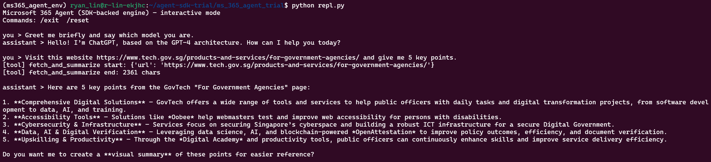

# Microsoft 365 Agent — Console Sample (Python)

Interactive console agent that:
- uses your **LiteLLM proxy** (OpenAI-compatible),
- supports the **`fetch_and_summarize(url)`** tool (requests + BeautifulSoup),
- prints **tool start/end logs**, and
- keeps **multi-turn** conversation history.

This “custom engine agent” matches the development model encouraged by the **Microsoft 365 Agents SDK** (bring your own AI stack, later deploy to M365 channels via the Toolkit/Adapters & Agents Playground). The SDK supports **Python**.  
References: Microsoft docs (overview & get started).  
- Agents SDK overview & supported languages (includes Python).  
- Create/deploy agents & test with **Agents Playground**.  
- Build agents with the toolkit (VS/VS Code).  


## 1. Setup

```bash
cd ~/agent-sdk-trial/ms_365_agent_trial
conda create -n ms365_agent_env python=3.11 -y
conda activate ms365_agent_env
python -m pip install -U pip setuptools wheel
pip install -r requirements.txt

```

## 2. Run
```bash
# Option A: Web host (Agents SDK) for Playground testing
python app.py

# Option B: Local REPL
python repl.py

```

## GPT-5



## claude-3-5-sonnet


## gemini-2.5-pro


## GPT4O-MINI
