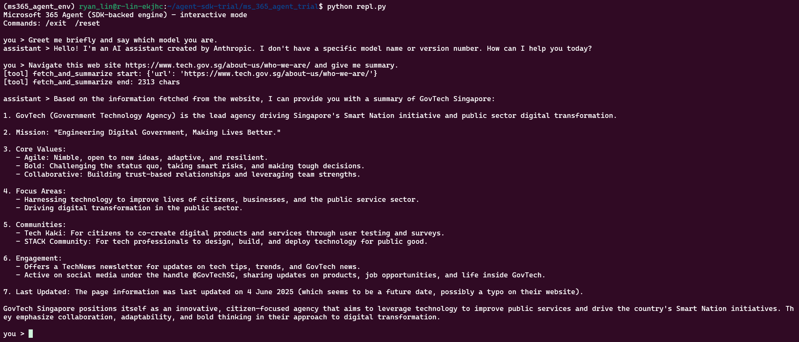
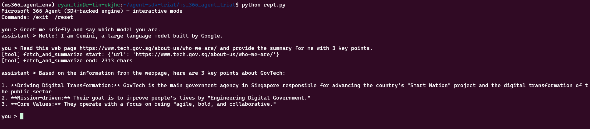
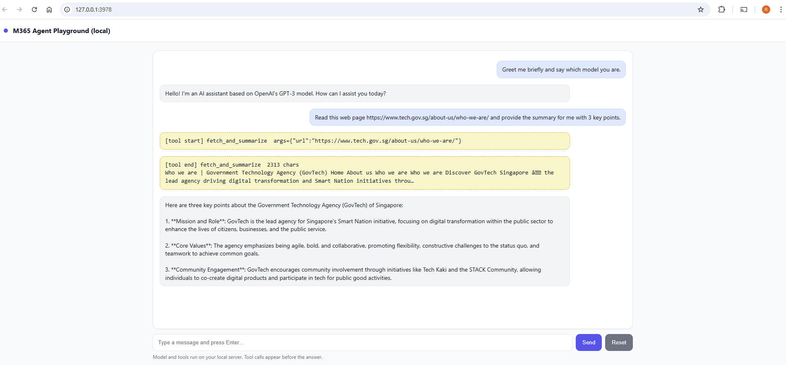
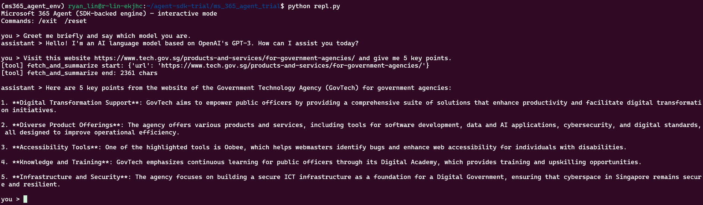

# Microsoft 365 Agent — Console Sample (Python)

Interactive console agent that:
- uses your **LiteLLM proxy** (OpenAI-compatible),
- supports the **`fetch_and_summarize(url)`** tool (requests + BeautifulSoup),
- prints **tool start/end logs**, and
- keeps **multi-turn** conversation history.

This “custom engine agent” matches the development model encouraged by the **Microsoft 365 Agents SDK** (bring your own AI stack, later deploy to M365 channels via the Toolkit/Adapters & Agents Playground). The SDK supports **Python**.  
References: Microsoft docs (overview & get started).  
- Agents SDK overview & supported languages (includes Python).  
- Create/deploy agents & test with **Agents Playground**.  
- Build agents with the toolkit (VS/VS Code).  


## 1. Setup

```bash
cd ~/agent-sdk-trial/ms_365_agent_trial
conda create -n ms365_agent_env python=3.11 -y
conda activate ms365_agent_env
python -m pip install -U pip setuptools wheel
pip install -r requirements.txt

```

## 2. Run
```bash
# Option A: Web host (Agents SDK) for Playground testing
python app.py

# Option B: Local REPL
python repl.py

```


## GPT-5 (Azure)
### Option A


### Option B


## claude-3-5-sonnet (Bedrock)
### Option A


### Option B



## gemini-2.5-pro (Vertex)
### Option A


### Option B


## GPT4O-MINI (Azure)

### Option A


### Option B



## DeepSeek-R1 (Azure)
### Option A


## gpt-oss-120b-1:0 (Bedrock)
### Option A


## LLAMA3.3 (bedrock)


## 3. How to know where the model is hosted?
```bash
LITELLM_PROXY_API_KEY=sk--123
LITELLM_PROXY_URL=https://litellm-stg.aip.gov.sg
URL="${LITELLM_PROXY_URL%/}"

curl -sS -H "Authorization: Bearer $LITELLM_PROXY_API_KEY" \
  "$URL/model/info" \
| jq -r '(.data // .)[]
         | select(.model_name=="anthropic.claude-3-5-sonnet-20240620-v1:0")
         | {model_name, backend: .litellm_params.model, region: .litellm_params.aws_region_name}'


```

