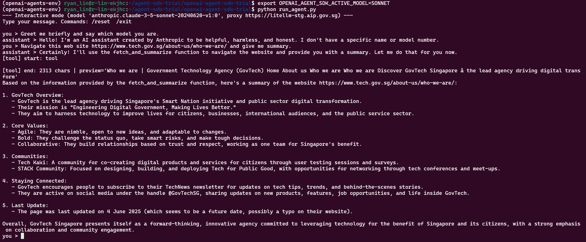

# OpenAI Agent SDK Trial

A minimal setup to run an agent using the OpenAI Agent SDK.

## Setup

```bash
cd ~/agent-sdk-trial/openai-agent-sdk-trial
conda create --name adk-agents-env python=3.11
conda activate openai-agents-env
pip install "openai-agents[litellm]" litellm python-dotenv boto3 requests beautifulsoup4
```

## Run
```bash
# 1. Trun Off Cloudware WARP

# 2. get the model list
python model_list.py

# 3. Run the agent
python run_agent.py
```

## Switch model
```bash
# Use Gemini 2.5 Pro
export OPENAI_AGENT_SDK_ACTIVE_MODEL=GEMINI_25_PRO
python run_agent.py


# Use GPT-5 Chat (Azure)
export OPENAI_AGENT_SDK_ACTIVE_MODEL=GPT5_CHAT
python run_agent.py

# Use GPT4O-MINI
export OPENAI_AGENT_SDK_ACTIVE_MODEL=GPT4O_MINI
python run_agent.py

# SONNET (Anthropic)
export OPENAI_AGENT_SDK_ACTIVE_MODEL=SONNET
python run_agent.py
```

## GPT-5 (Azure)


## SONNET (Anthropic)


## Gemini 2.5 Pro


## GPT4O-MINI


